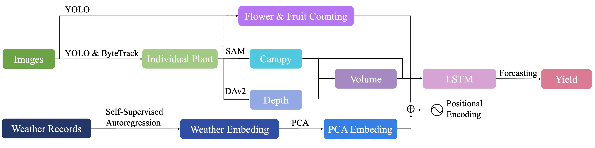

# PheMuT: A Phenology-Informed, Multi-Modal Time-Series Model for Strawberry Yield Forecasting



## Overview
PheMuT integrates multi-season visual phenotyping data, canopy geometry estimates, and high-frequency meteorological observations to deliver multi-week strawberry yield forecasts. The pipeline marries state-of-the-art computer vision (dual YOLOv11 detectors, ByteTrack, SAM, Depth Anything v2) with a self-supervised autoregressive temporal convolutional network (TCN) that compresses weather time series into informative embeddings. The resulting fused representation supports nuanced, phenology-aware forecasting that is robust to rapid crop transitions typical of commercial strawberry production.

Use this repository to reproduce the analyses from Huang *et al.* (2026), extend the model to new seasons, or adapt the architecture to related specialty crops.

## Key Capabilities
- **Phenology-centric forecasting**: Encodes flower/fruit developmental stages and canopy morphology to preserve crop context across horizons.
- **Multi-modal fusion**: Couples visual detections with learned weather embeddings for resilient, data-efficient predictions.
- **Reproducible experiments**: Provides ready-to-run scripts for forecasting, diagnostics, interpretability, and weather embedding training.
- **Interpretability tooling**: Supplies lagged correlations and permutation-importance analyses to explain feature utility across horizons.

## Repository Layout
- `src/phemut/`: core library code
  - `forecasting/`: experiment drivers, model definitions, training/evaluation helpers
  - `analysis/`: diagnostics, interpretability, and weather embedding modules
- `scripts/`: thin entry points that configure `PYTHONPATH` and invoke the library modules
- `data/`: versioned processed tabular field data plus local-only raw data or learned embeddings
- `outputs/`: auto-created directory for metrics, plots, and logs
- `assets/`: figures used in documentation (e.g., `assets/ppline.png` shown above)
- `docs/`: supplementary material, including the original citation snapshot (`docs/citation.html`)

## Data Access & Organization
This repository includes the processed tabular CSV files used by the forecasting
experiments. Raw imagery, image-derived frame outputs, canopy reconstructions,
learned embeddings, and model weights are not versioned. If you have access to
those local artifacts, arrange the folder structure as follows:

```
data/
  2324_GNV_processed/
    240123/
      consolidated_summary_with_yield.csv
      ...
    counting_yield/
      240123.csv
      ...
    2324_weather.csv
  2425_GNV_processed/
    ...
  weather_allout/
    2324/
      embed.npy
      model.pth
    2425/
      embed.npy
      model.pth
```

The `weather_allout/` artifacts can be regenerated with `scripts/weather_auto_regression.py` if they are not distributed with your data package.

## Environment Setup
PheMuT targets Python 3.10+ with PyTorch, NumPy, pandas, scikit-learn, matplotlib, and adjustText. Install the dependencies with

```
pip install torch numpy pandas scikit-learn matplotlib adjustText
```

For GPU execution, follow the [official PyTorch installation selector](https://pytorch.org/get-started/locally/) to match your CUDA toolkit.

## Running Experiments
All experiments are launched from the `scripts/` directory; each script sets up paths before delegating to the `phemut` modules.

| Task | Command |
| --- | --- |
| Baseline yield forecasting | `python scripts/run_yield_forecast.py` |
| Batched/multi-model forecasts | `python scripts/run_parallel_models.py` |
| Weather embedding training | `python scripts/weather_auto_regression.py` |
| Data diagnostics & plots | `python scripts/data_analysis.py` |
| Interpretability suite | `PYTHONPATH=src python scripts/interpretability_analysis.py` |

Adjust configuration constants inside the corresponding modules (`src/phemut/forecasting` and `src/phemut/analysis`) to tailor seasons, horizons, feature sets, or training hyperparameters.

## Outputs
Generated artifacts are written under `outputs/`:
- `outputs/forecasting/results/`: forecast curves, tables, and derived metrics
- `outputs/forecasting/logs/`: process- and seed-specific logs for distributed runs
- `outputs/analysis_plots/`: diagnostics for season quality assurance and embedding sanity checks
- `outputs/interpretability/`: lagged correlation heatmaps, permutation-importance plots, and CSV exports

## Interpretability Details
The interpretability toolkit combines two complementary analyses:
1. **Lagged correlations** compute Pearson correlations between each feature at week `t` and yield at future horizons `t + h`, yielding season-specific heatmaps plus tabular exports (`outputs/interpretability/lagged_corr_*.png`, `.csv`).
2. **Permutation importance** trains a lightweight LSTM surrogate, permutes each feature channel, and tracks RMSE degradation across horizons, producing plots (`perm_importance_*.png`) and ranking tables.

Adjust inputs (`input_rows`), horizons (`horizons_by_season`), sequence lengths, and hyperparameters directly in `scripts/interpretability_analysis.py` to match the season or modality mix you wish to study.

## Citation
If PheMuT informs your research, please cite the original article:

> Huang, Z., Lee, W. S., Ampatzidis, Y., Agehara, S., & Peres, N. A. (2026). *PheMuT: A phenology-informed, multi-modal time-series model for strawberry yield forecasting*. Computers and Electronics in Agriculture, 244, 111526.

A copy of the ScienceDirect citation metadata and abstract is preserved in `docs/citation.html` for reference (access via University of Florida libraries). When sharing derived work, refer to that file or the journal page to ensure the metadata stays authoritative.

## Contact
For collaboration requests, dataset access, or integration questions, please reach out to the corresponding author listed in the paper or open an issue in this repository.
